<div align="center">
  

  <p><strong>Messenger automation without the noise.</strong></p>

  <p>
    <a href="https://www.npmjs.com/package/mahmud-aura"></a>
    <a href="https://github.com/mahmud-aura/aura-fca"></a>
    <a href="https://nodejs.org"></a>
  </p>
</div>

MetaChat is a CommonJS library for Facebook Messenger automation. It combines session-aware authentication, real-time MQTT events, and practical messaging APIs in one focused client.

## Install

```bash
npm install aura-fca
```

## Quick start

Keep your exported browser session outside the repository.

```js
const { login } = require("aura-fca");

const api = await login({
  appState: require("./appstate.json"),
  listenEvents: true,
  autoReconnect: true,
  autoReLogin: false,
});

api.listenMqtt(async (error, event) => {
  if (error) throw error;
  if (event?.type !== "message") return;

  await api.sendMessage(`Echo: ${event.body}`, event.threadID);
});
```

## Built for

- Real-time message events through MQTT
- Text, attachments, stickers, replies, mentions, and locations
- Thread, user, reaction, typing, and read-state operations
- Session recovery, reconnects, rate limiting, and request validation
- CommonJS and TypeScript consumers

## Core API

```js
api.sendMessage(message, threadID);
api.listenMqtt(callback);
api.getThreadInfo(threadID);
api.getUserInfo(userID);
api.sendTypingIndicator(true, threadID);
api.logout();
```

## Security

Never commit `appstate.json`, cookies, passwords, or access tokens. Load session data from a secure secret store or a file excluded from version control.

## License

MIT © [MahMUD](https://github.com/mahmud-aura)

<div align="center">
  <sub>Built for focused, reliable Messenger automation.</sub>
</div>
